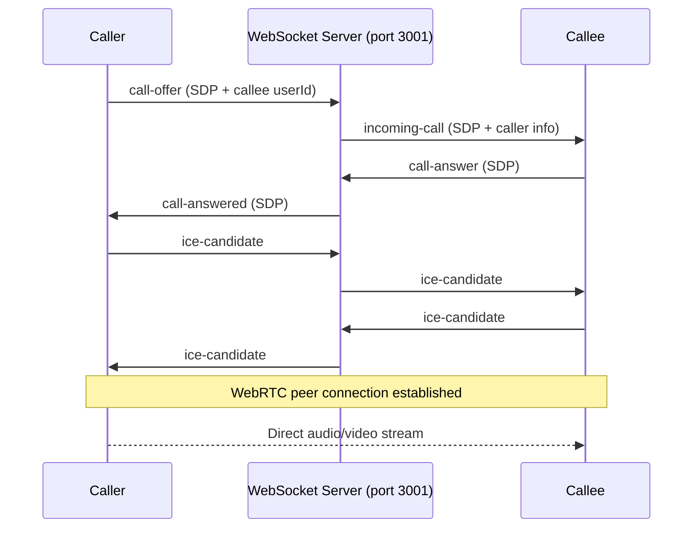

# Voice & Video Calling via WebRTC

Add 1:1 voice and video calling to the DraftDock messaging UI, extending the existing WebSocket server for signaling.

## Architecture

## Proposed Changes

### Backend — WebSocket Signaling

#### [MODIFY] [websocket.ts](file:///c:/Users/supri/OneDrive/Desktop/Techincal-Phase-2/Techincal-Phase-2/apps/backend/src/lib/websocket.ts)

Add JSON message handlers inside the existing `ws.on('message')` callback for:
- `call-offer` → forward SDP offer + caller info to the target user
- `call-answer` → forward SDP answer back to the caller
- `ice-candidate` → relay ICE candidates between peers
- `call-end` → notify the other party that the call ended
- `call-reject` → notify the caller that the callee rejected
- `call-busy` → notify when callee is already in a call

Uses the existing `userConnections` Map to route messages to specific users.

---

### Frontend — WebRTC Client & Call UI

#### [NEW] [useWebRTC.ts](file:///c:/Users/supri/OneDrive/Desktop/Techincal-Phase-2/Techincal-Phase-2/apps/frontend/src/hooks/useWebRTC.ts)

Custom React hook that encapsulates:
- WebSocket connection to `ws://localhost:3001` with `register:userId`
- `RTCPeerConnection` lifecycle (create offer/answer, handle ICE candidates)
- `navigator.mediaDevices.getUserMedia()` for camera/mic access
- State: `callState` (idle, calling, ringing, connected), local/remote streams
- Methods: `startCall(userId, type)`, `acceptCall()`, `rejectCall()`, `endCall()`, `toggleMic()`, `toggleCamera()`
- Uses free Google STUN servers: `stun:stun.l.google.com:19302`

#### [NEW] [CallModal.tsx](file:///c:/Users/supri/OneDrive/Desktop/Techincal-Phase-2/Techincal-Phase-2/apps/frontend/src/components/CallModal.tsx)

Full-screen overlay component with:
- **Outgoing call**: "Calling {name}..." with avatar animation + cancel button
- **Incoming call**: "{name} is calling" with Accept/Reject buttons
- **Connected**: Video feeds (local PiP + remote full-screen), call timer, control bar
- **Controls**: Mute mic, toggle camera, end call, minimize
- Dark glassmorphic design consistent with messaging aesthetic

#### [MODIFY] [Messages.tsx](file:///c:/Users/supri/OneDrive/Desktop/Techincal-Phase-2/Techincal-Phase-2/apps/frontend/src/pages/Messages.tsx)

- Wire up Video and Phone header buttons to call `startCall(userId, 'video'|'audio')`
- Mount `<CallModal>` at the top level
- Remove "coming soon" disabled styling from call buttons

## Verification Plan

### Manual Testing
1. Open two browser tabs logged in as different users
2. Navigate to Messages → open a conversation
3. Click the Phone/Video icon → verify outgoing call UI appears
4. In the other tab → verify incoming call notification appears
5. Accept the call → verify peer-to-peer audio/video connection establishes
6. Test mute, camera toggle, and hang up controls
7. Test reject flow → verify caller is notified

### Edge Cases
- Calling an offline user → show "User is offline" feedback
- Calling when already in a call → show busy state
- Browser denying camera/mic → show permission error UI
